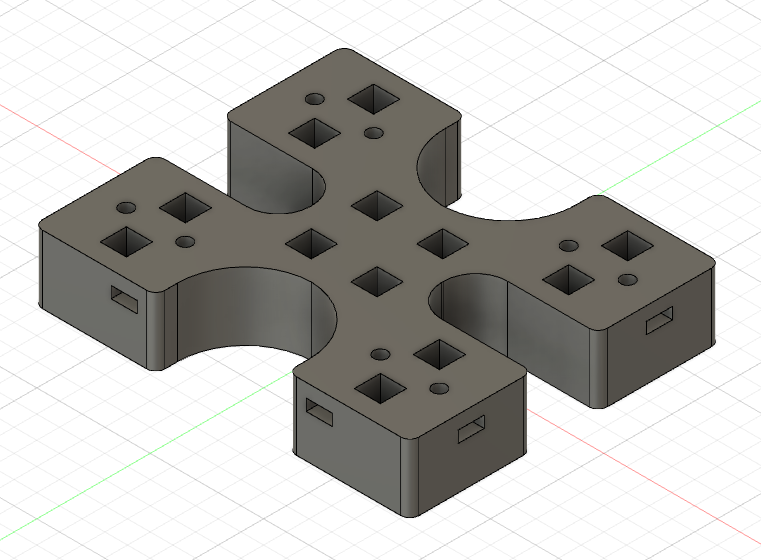
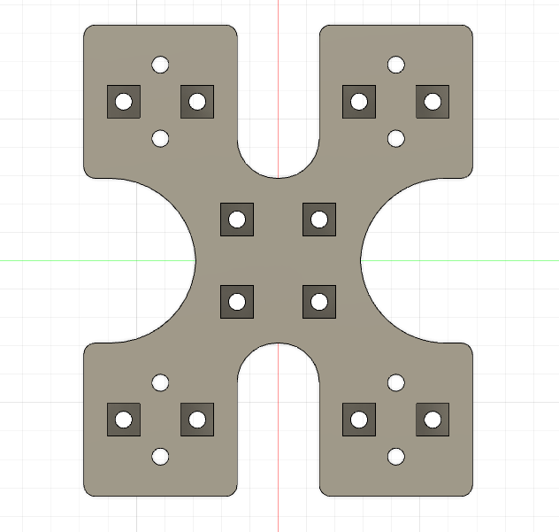
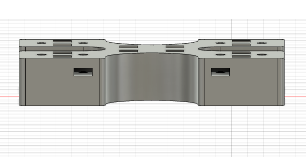
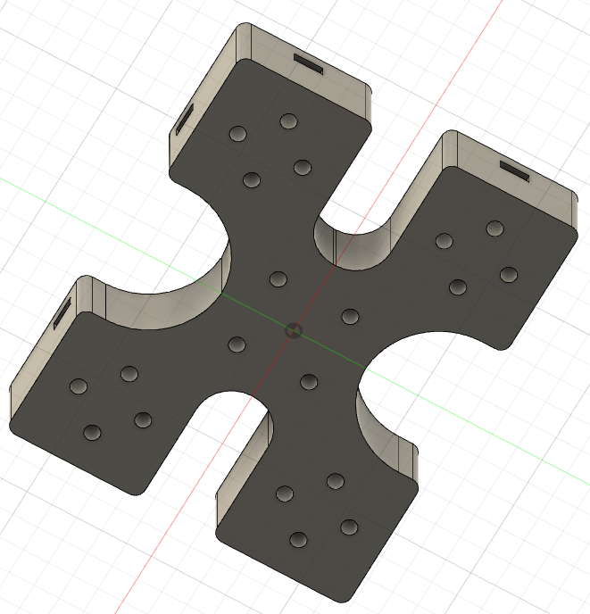

# Axis Body

This component is a hub to which 8 `Mountable Linear Bearing Holder` components are attached via M3 metric hex bolts and captive square nuts. 

Linear bearings are inserted into the bearing holders and this `Axis Body` slides up and down Y Axis Guide rails and holds the sliding X Axis Guide Rails.

## Component

## Top Face View

## Side View Showing Slots for Captive Square Nuts

## Bottom Face View
