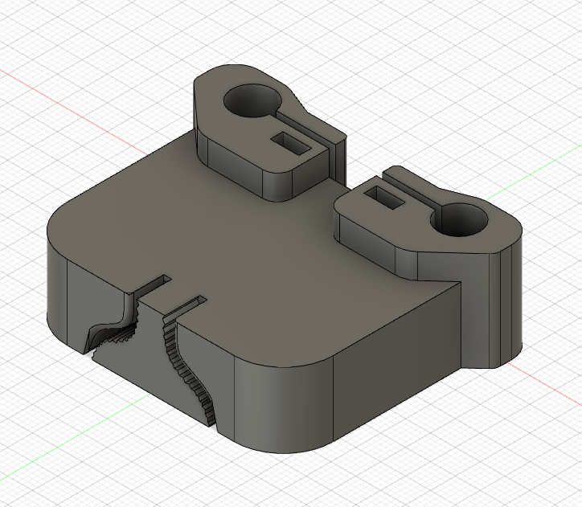
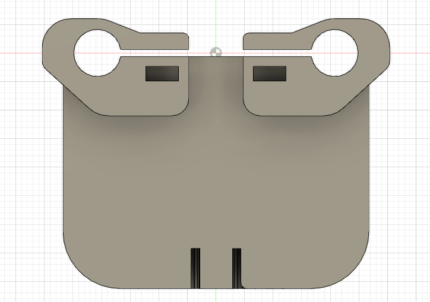
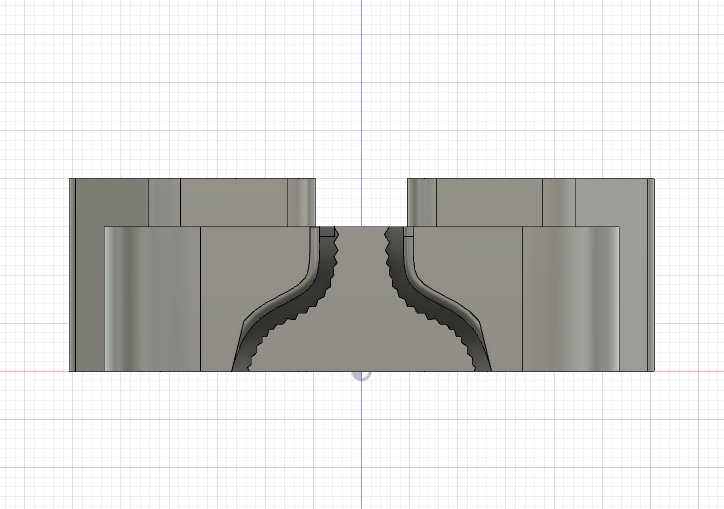
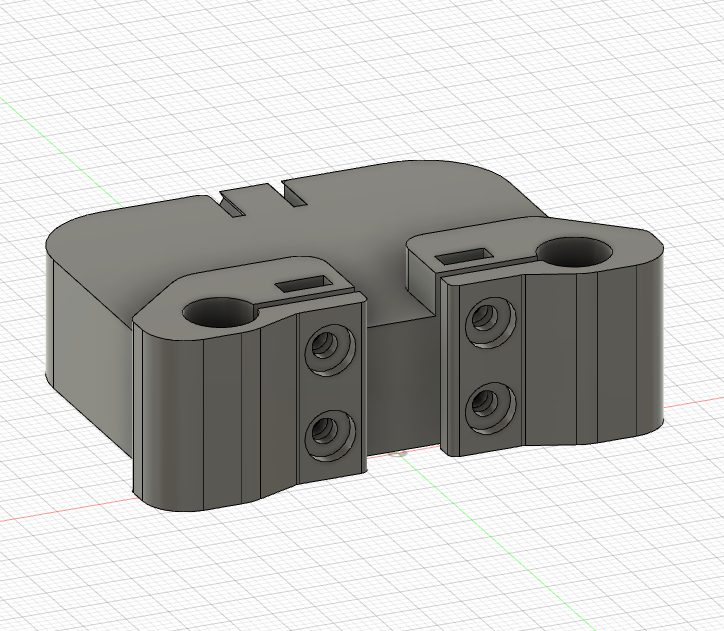

# Axis Body

This component is attached to the X Axis guide rails using the top rod holding clamps using M3 metric bolts and captive nuts inserted into the slots.

The bottom two slots are meant to hold a 5mm pulley. Once the pulley is looped into the whole system, it will be held stationary here and tensioned via these slots.

## Component

## Face View

## Side View Showing Slots for Pulley Tensioning

## Top View Showing Clamping Bolt Holes
