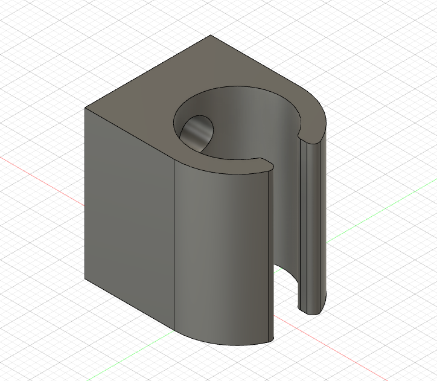
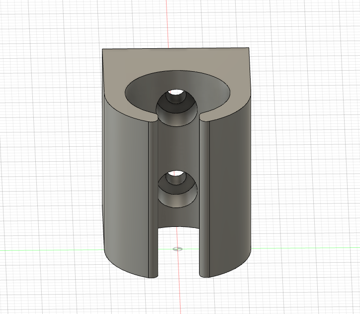

# Mountable Linear Bearing Holder

This is not the ideal part, it adds more height to the `Axis Body` than I wanted once I mount 4 on the top and body. I'll probably redesign this part and the `Axis Body` to keep it flatter. The reason that this height is a problem is that when the X Axis is fully extended in one direction, a good amount of torque is being applied perpendicular to the Y Axis since the guide rails are metal (heavy) and 450mm long.

Added height for the X Axis rod holders just raises the potential energy and therefore increases the torque on Y Axis. I'm already worried about calibration issues because of varying pressure applied on Y Axis rods when X Axis is extended to various lengths and this height differential will just amplify those errors.

## Component

## Straight on View

## View of the Back
