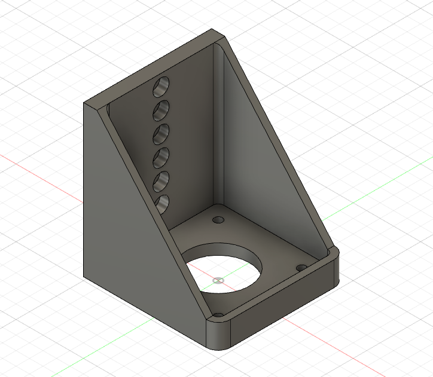
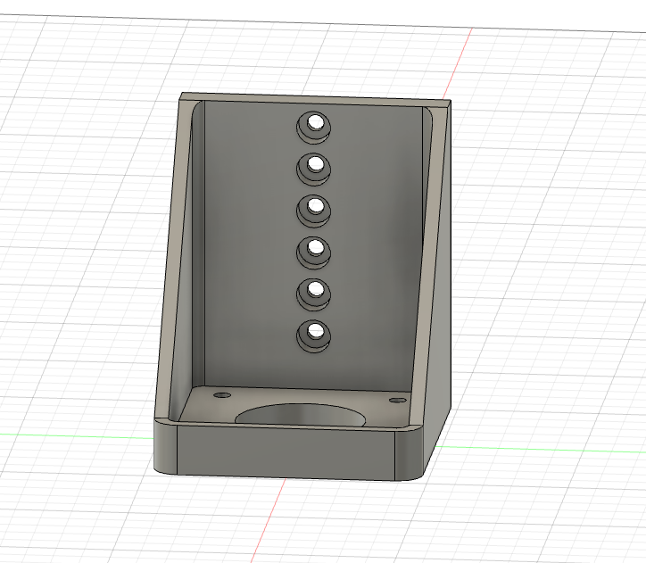
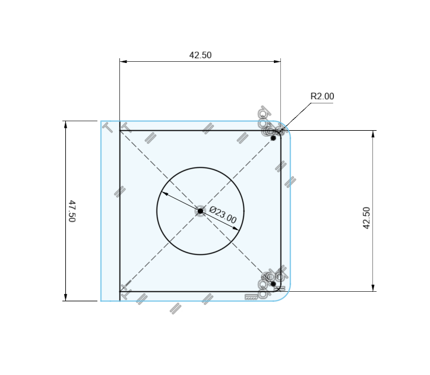

# NEMA 17 Motor Mount

I'm using NEMA 17 stepper motors for this project, at the highest point on the Y Axis, the other at the lowest. They will drive the same pulley and adjust X and Y movement by either driving in opposite directions or the same direction for X and Y movements respectively.

This motor mount is adjustable and will mount to the `Y Axis Guide Rail Mount and Motor Mount Holder` components. The motor will be upside down and mounted by the face. This part will fit any NEMA 17 motor face since they are all the same dimension on the face and it should accomodate almost any holding torque rating (depth). 

I'm using a couple small 20 mm deep NEMA 17s with a step angle of 1.8 degrees and a holding torque of only 16Ncm... The step angle is plenty of precision but there's almost no way that torque will be enough. I don't have a stepper driver right now that supports two motors with phase rated over 1A current... so I'm going to try them first.

## Component

## Front View

## Motor Face Dimensions
