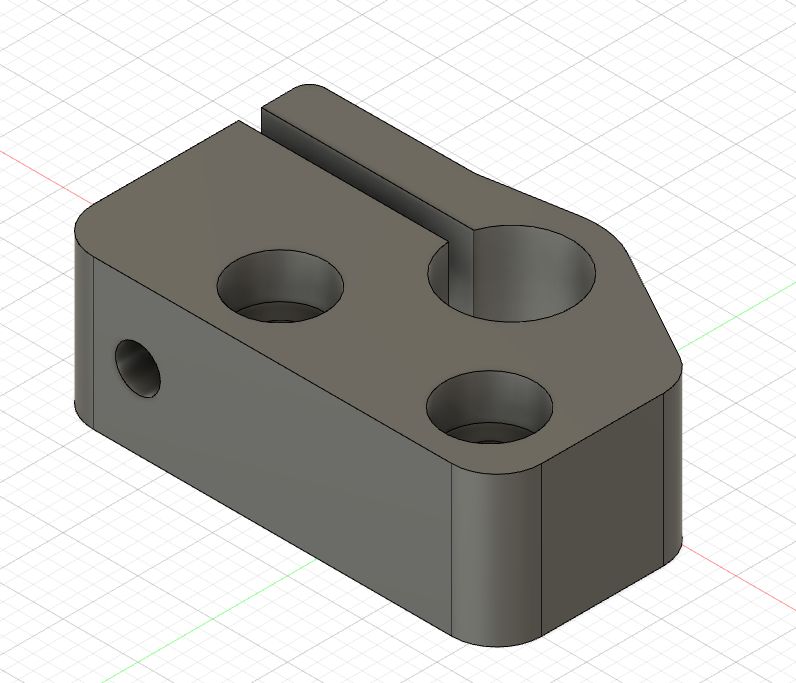
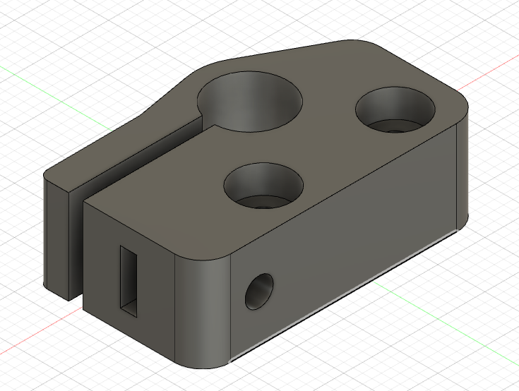
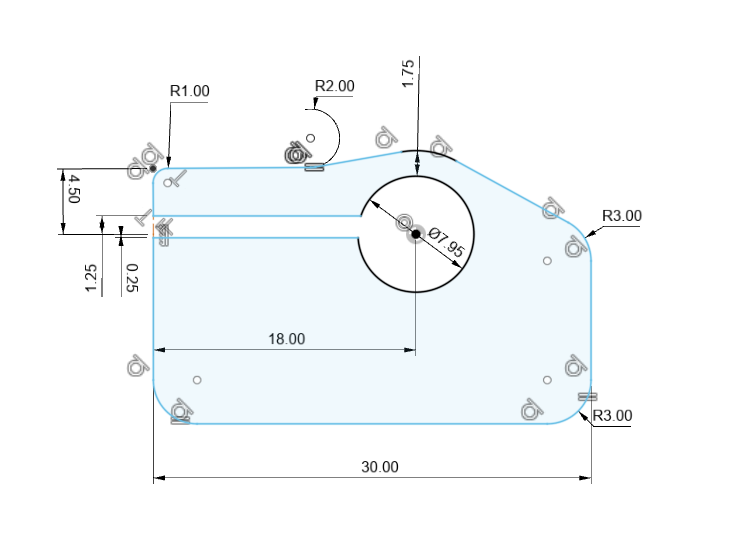
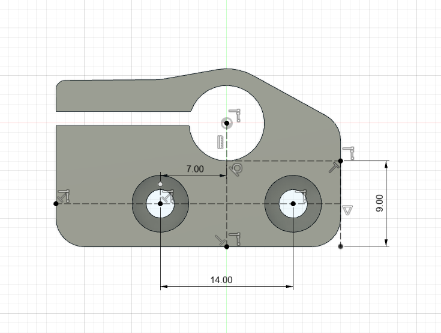

# Y Axis Guide Rail Clamps

I wanted a way to elevate the Y Axis guide rails above the drawing surface but I didn't want to mount them in the `Y Axis Guide Rail Mount and Motor Mount Holder` components at the end of the Y Axis so I went with this piece. It clamps onto the guide rail and then can bolt into the `Y Axis Guide Rail Mount and Motor Mount Holder`. It's alright, I wouldn't do it again this way.

## Component

## Other Side View

## Top Face Dimensions 1

## Top Face Dimensions 2
