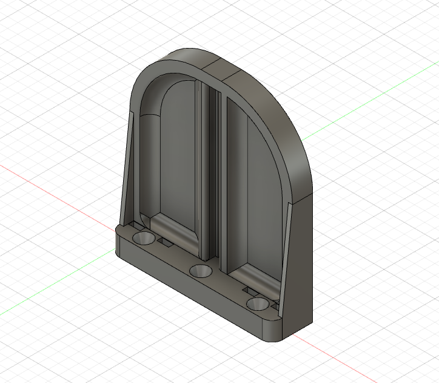
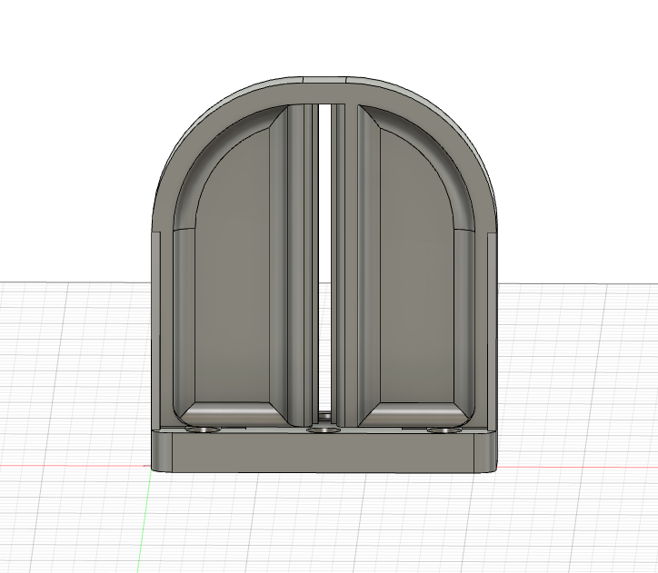
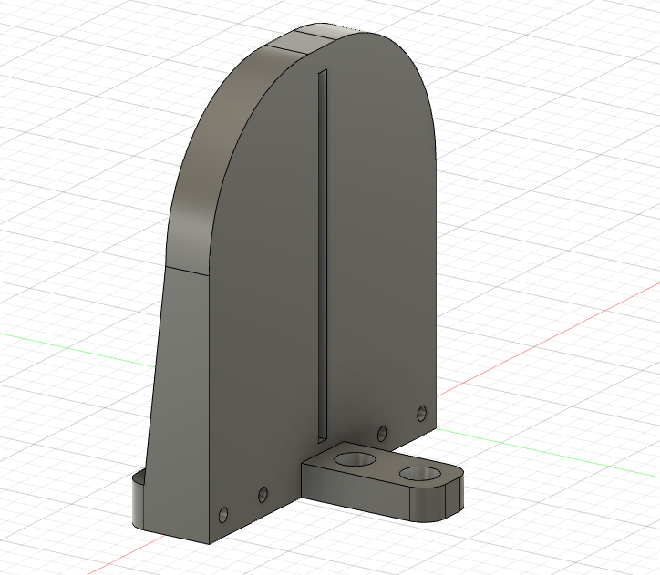
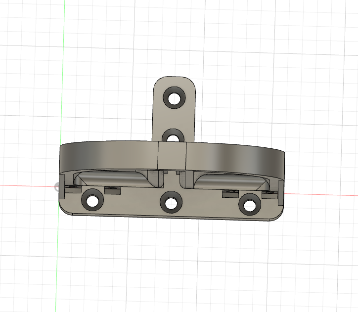

# Y Axis Guide Rail Mount and Motor Mount Holder

This is definitely the worst part in the whole setup, I don't know what I was thinking with this. I'll definitely redesign it when I have time.

The flat side of the mount face into the Y Axis and hold the motor mounts. That's really dumb because the motor mounts take up space within the Y Axis and limit the range of movement for the `Axis Body` on those rails for no reason. It cuts 100mm out of the potentially drawable space.

The slot cut in the face of this is for 5mm square nuts which are held captive in the slot for the `NEMA 17 Motor Mount` to be mounted on. That adjustibility is nice but it's facing the wrong direction since I would rather mount those on the outside of the Y Axis and not remove the drawing space. The slot should be wider at the bottom which will let me pass the pulley through the mount and into the Y Axis path.

Also mounted to this piece are the two `Y Axis Guide Rail Clamps` which hold the Guide Rails tight and elevated.

## Component

## Front View

## Mount Plate View

## Top View
